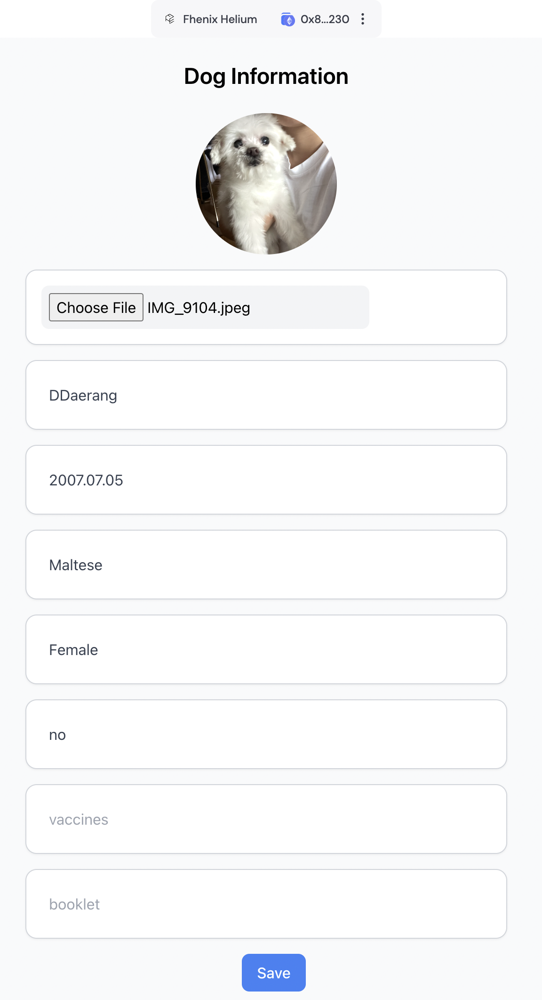

<!-- PROJECT LOGO -->
 

  

  <h3 align="center">Pet ID</h3>

  

    Pet Id is a blockchain based Pet Identity Provider accessible worldwide.
     
    <a href="https://github.com/Pet-ID-Vault/pet-id/documentation.pdf"><strong>Explore the docs »</strong></a>
     
     
    <a href="https://pet-id.eth.pm">View Demo</a>
    ·
    <a href="https://github.com/Pet-ID-Vault/pet-id/issues/new?labels=enhancement&template=feature-request---.md">Request Feature</a>
  

<!-- TABLE OF CONTENTS -->

  
Table of Contents

  <ol>
    <li>
      <a href="#about-the-project">About The Project</a>
      <ul>
        <li><a href="#built-with">Built With</a></li>
      </ul>
    </li>
    <li>
      <a href="#getting-started">Getting Started</a>
      <ul>
        <li><a href="#prerequisites">Prerequisites</a></li>
        <li><a href="#installation">Installation</a></li>
      </ul>
    </li>
    <li><a href="#roadmap">Roadmap</a></li>
    <li><a href="#contributing">Contributing</a></li>
    <li><a href="#license">License</a></li>
    <li><a href="#contact">Contact</a></li>
    <li><a href="#acknowledgments">Acknowledgments</a></li>
  </ol>

<!-- ABOUT THE PROJECT -->
## About The Project

[Pitch Deck](https://www.canva.com/design/DAGKz9MVwLI/WCQ52_4qP-ZP851flMBkSA/edit)

  

Pet ID provides a global, blockchain-based proof of identity infrastructure for pets, 
offering secure and universally accessible identity verification solutions for everyday pet owners.

(<a href="#readme-top">back to top</a>)

### Built With

* [![React][React.js]][React-url]

(<a href="#readme-top">back to top</a>)

<!-- GETTING STARTED -->
## Getting Started

Please refer to the README.md of frontend.

(<a href="#readme-top">back to top</a>)

<!-- ROADMAP -->
## Roadmap

- [x] NFC-enabled Pet ID Tags
- [ ] IFPS support for pet images
- [ ] Pet NFT tokens

See the [open issues](https://github.com/Pet-ID-Vault/pet-id/issues) for a full list of proposed features (and known issues).

(<a href="#readme-top">back to top</a>)

<!-- LICENSE -->
## License

Distributed under the MIT License. See `LICENSE.txt` for more information.

(<a href="#readme-top">back to top</a>)

<!-- MARKDOWN LINKS & IMAGES -->
<!-- https://www.markdownguide.org/basic-syntax/#reference-style-links -->
[product-screenshot]: statics/screenshot.png
[React.js]: https://img.shields.io/badge/React-20232A?style=for-the-badge&logo=react&logoColor=61DAFB
[React-url]: https://reactjs.org/